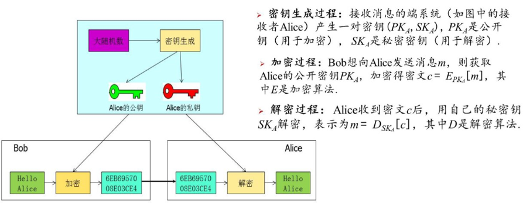
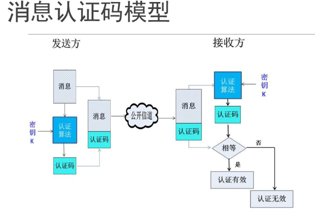
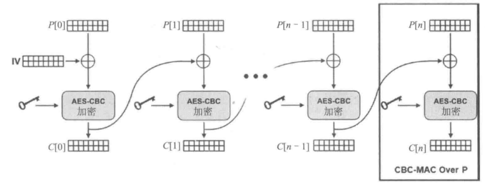

# Python密码学编程

[TOC]


## 古典密码学编程

古典密码主要通过字符间的置换和代(替)换实现

**代换密码**(substitution)：代换是古典密码中用到的最基本的处理技巧之一。所谓代换，就是将明文中的一个字母由其他字母、数字或符号替代的一种方式，代换密码可以分为：

- 凯撒密码
- 仿射密码
- 单表代换
- 多表代换

### Caesar密码

 **数学描述**：

明文$p\in Z_{26}$,密文$c\in Z_{26}$，密钥k取[1,25]

加密：
$$
c=E(p)=(p+k)~mod~26\\
$$
解密:
$$
p=D(c)=(c-k)~mod~26
$$

### 仿射密码

**数学描述**:

明文$p\in Z_{26}$,密文$c\in Z_{26}$

密钥k=(a,b)$\in Z_{26}^*\times Z_{26}$,且gcd(a,26)=1

> "*"表示非零
>
> "gcd(a,26)=1"
>
> 当且仅当a与模数26互质时，a的模逆元才存在。因此，要求gcd(a,26)=1是为了保证解密过程中能够找到a的模逆元。

加密:
$$
c=E(p)=(a\times p + b)~mod~26
$$
解密:
$$
p=D(c)=(c-b)\times a^{-1}~mod~26
$$


### 单表代换密码

数学描述:

明文p$\in(Z_{26})^m$，密文c$\in(Z_{26})^m$

密钥k$\in \{Π|定义在0,1,2,...,25上的置换\}$

加密:
$$
c=k(p1),k(p2),...,k(p_m),...;
$$
解密:
$$
c=k^{-1}(p1),k^{-1}(p2),...,k^{-1}(p_m),...;
$$


### 多表代换密码

简化多表代换密码-维吉尼亚密码：由26个类似caesar密码的代换表组成

数学描述:

明文$p\in(Z_{26})^m$,密文$c\in(Z_{26})^m，密钥k\in(Z_{26})^m$

加密:
$$
c=(p_1+k_1,p_2+k_2,...,p_m+k_m)~mod~26
$$
解密：
$$
p=(c_1-k_1,c_2-k_2,..,c_m-k_m)~mod~26
$$


### 置换密码

将明文字符按照某种规律重新排列从而形成密文的过程

**数学描述**

明文$p\in(Z_{26})^m$,密文c$\in(Z_{26})^m$

密钥k$\in\{Π|定义在1,2,3,..,m上的置换\}$


## 哈希编程

### 哈希函数

将一种任意长度的输入变换成固定长度输出的不可逆的密码体制

别名：哈希函数、散列函数、杂凑函数；输出：消息摘要，指纹

性质：

- 可用于"任意"长度的消息
- 产生定长的输出
- 对"任意"给定的消息x，计算H(x)比较容易
- 单向性：抗原像性，给定任意的散列值y，找到H(x)=y的消息在计算上是不剋性的
- 抗弱碰撞性：抗第二原像性，对任意给定消息x，找到满足y$\ne$x,且H(x)=H(y)的消息y在计算上是不可行的

- 抗强碰撞性：找到任何满足H(x)=H(y)的偶对(x,y)在计算上是不可行的

用途：用于保证消息完整性，口令加密，数字签名，区块链


### 抗强碰撞安全性分析

**生日悖论**

令$r_1,r_2,...,r_n\in \{1,...,N\}$是相互独立同分布整数,当
$$
n=1.2\times N^{\frac12}
$$

$$
P_r[\exist i \ne j:r_i=r_j]\ge \frac12
$$

**生日攻击**


### 哈希算法

**MD族**

散列算法MD族的MD代表消息摘要(message-digest)

md2、md4、md5 都产生一个128位的信息摘要

**SHA系列**

SHA系列算法是NIST根据MD4和MD5开发的算法，国家安全当局发布SHA作为美国政府标准，SHA表示安全散列算法


### 哈希函数构造


如图所示：

1. 哈希函数的初始值是固定的

2. 哈希函数将消息分块进行处理

3. 需要进行长度填充

**消息填充**

SHA-256消息填充

首先将比特"1"添加到消息末尾，然后添加k个0,且k是满足
$$
l+1+k\equiv 448~mod~512
$$
的最小非负解

最后再添加一个64比特长的块，其值等于消息M的长度l的二进制表示，使得填充后的消息是512比特的倍数


**压缩函数**


### 推荐使用的Hash算法

1. SHA-2系列

**SHA-256** 生成256位(32字节)的哈希值，是目前最常用的安全哈希函数之一，广泛应用于区块链，TLS加密等邻域

**SHA-512** 生成512位(64字节)的哈希值，适合对安全性要求更高，计算资源丰富的场景


2. SHA-3系列

一种基于Keccak算法的哈希函数，设计用于增强安全性。与SHA-2不同的是，SHA-3采用了不同的算法结构(海绵结构)，再抗碰撞攻击方面更具潜力

SHA3-256 SHA3-512是常用的版本


3. MD5 SHA-1

不推荐

4. BLAKE2

一种快速且安全的哈希函数，设计目标是比SHA-2更快，且能保持类似的安全性，适合密码学安全应用，同时还能再许多嵌入式系统中应用

5. RIPEMD-160

生成160位哈希值，主要用于PGP等加密软件中，具有较好的抗碰撞性

6. scrypt和bcrypt

主要用于密码学中的密钥派生，通过引入计算强度和内存强度来防止暴力破解和硬件加速攻击


### Hash编程实现

```py
import hashlib

# 创建md5对象
m=hashlib.md5()

# 以字符串参数更新哈希对象
m.update(b"hello,world!")

# 获取16进制消息摘要

print(m.hexdigest())
```


**哈希雪崩**

输入小的更改，会导致摘要中不可预测的大更改

```py
import hashlib

hex_string=hashlib.md5(b'bob').hexdigest()
print(hex_string)

bin_string=bin(int(hex_string,16))
print("{}\n{}".format(bin_string[2:66],bin_string[66:]))

hex_string=hashlib.md5(b'cob').hexdigest()
print(hex_string)

bin_string=bin(int(hex_string,16))
print("{}\n{}".format(bin_string[2:66],bin_string[66:]))
```


输出结果

```py
9f9d51bc70ef21ca5c14f307980a29d8
1001111110011101010100011011110001110000111011110010000111001010
0101110000010100111100110000011110011000000010100010100111011000
386685f06beecb9f35db2e22da429ec9
1110000110011010000101111100000110101111101110110010111001111100
11010111011011001011100010001011011010010000101001111011001001
```


MD5被证明在抗碰撞性上非常脆弱，创建两个生成相同输出的MD5输入是容易的


我们可以使用SHA-256及以上算法，使用方式基本相同


**用户口令的哈希处理**

在Web站点1注册用户名、口令时，存储的不是口令，而是口令的hash

但是常见词语的hash值可以查到

我们可以使用密钥派生函数来处理用户口令哈希


**常见的密钥派生函数**

PBKDF2(已被淘汰)

PBKDF2是一个简单的从密码派生密钥的KDF，它可以抵抗字典攻击和彩虹表攻击。

Scrypt

Scrypt 是一个强大的密钥派生函数，其通过内存密集的计算方式来抵抗 GPU、ASIC、FPGA 这类密码破解硬件的攻击。

Bcrypt(开始淘汰)

Bcrypt 也是一个 KDF ，问世时间早于 Scrypt ，对于 ASIC 、GPU 攻击的抗性相对弱一些。其虽然也可以配置迭代数，但由于对内存的压力较小，因此比较容易构建相应的硬件加速密码破解器。

HKDF


**Scrypt使用**

```py
import os
from cryptography.hazmat.primitives.kdf.scrypt import Scrypt
from cryptography.hazmat.backends import default_backend

salt=os.urandom(16)
kdf=Scrypt(salt=salt,length=32,n=2**14,r=8,p=1,backend=default_backend())
key=kdf.derive(b'my great password')
print(key)
```

参数说明


**工作量证明**

找到一个特殊的SHA-256哈希值

```py
# 5、实现区块链中的工作量证明编程，通过设置不同的难度，体会生成符合要求哈希值需要时间长短的不同；
import time
from typing import Tuple
import hashlib

def proof_of_work(last_proof: int, difficulty: int) -> Tuple[int, int]:
    """
    工作量证明算法实现
    :param last_proof: 上一个区块的哈希值（在此示例中简化为整数）
    :param difficulty: 难度，即要求哈希值前导零的数量
    :return: (proof, hash_value)
    """
    proof = 0
    while True:
        guess = f'{last_proof}{proof}'.encode()
        guess_hash = hashlib.sha256(guess).hexdigest()
        if guess_hash[:difficulty] == '0' * difficulty:
            print(f'Proof found: {guess_hash}')
            print(f'Proof: {proof}')
            return proof, guess_hash
        proof += 1


difficulty = 4  # 初始难度设置为4，即哈希值前导零的数量为4
last_proof = 1  # 假设上一个区块的哈希值（或简单编号）为1

# 测试不同难度下的工作量证明时间
for diff in [1, 4, 6]:
    start_time = time.time()
    proof, hash_value = proof_of_work(last_proof, diff)
    end_time = time.time()
    print(f'Difficulty: {diff}, Time taken: {end_time - start_time:.2f} seconds')
    last_proof = proof  # 更新上一个区块的哈希值（或编号）为当前找到的proof
```

运行结果

```py
Proof found: 0f8ef3377b30fc47f96b48247f463a726a802f62f3faa03d56403751d2f66c67
Proof: 25
Difficulty: 1, Time taken: 0.00 seconds
Proof found: 000006aa196c7510ca3b4617e7e52d9527e0190e9152fb2ccff0e1d2e5de31d1
Proof: 85022
Difficulty: 4, Time taken: 0.07 seconds
Proof found: 0000000d7bfc2da334c7a3499b7ec9224a448022a41f38fe2cdfc71959b814f5
Proof: 1903624
Difficulty: 6, Time taken: 1.59 seconds
```

## 对称加密

### 保密通信系统模型


一个密码体制是一个五元组:
$$
(P,C,K,E,D)
$$
依次是明文空间，密文空间，密钥空间，加密变换和解密变换

一个加密变换是一个下列形式的映射：
$$
E:P\times K \to C
$$
一个解密变换时一个与加密E变换相应的映射
$$
D:C\times K \to P
$$
给定$k\in K$,我们将E(\*,k)记作$E_k$，将D(\*,k)记作$D_k$


一个定义在空间(P,C,K)上的密码算法，E和D时一对有效的算法

对于$\forall k\in K,\forall m\in P$
$$
D_k(E_k(m))=m
$$


### 常用对称加密算法

对称加密：加密和解密使用相同的密钥的密码体制

1. 分组密码：将明文消息编码表示后的二进制序列，划分为固定大小的块，每块分别在密钥控制下变换成等长的二进制序列

- AES
- DES
- IDEA
- RC6
- SM1,SM4,SM7,ZUC对称密码，SM1、SM7算法不公开，调用算法时，需要通过加密芯片的接口进行调用

2. 流密码：将明文信息按比特进行加密


**分组密码定义**

一个分组密码体制(P,K,C,E,D),其中P=C=$\{0,1\}^l$;K=$\{0,1\}^t$

加密变换：
$$
E:P\times K\to C
$$
当$k\in K$确定时，$E_k$为$P\to C$的一一映射

解密变换：
$$
D:C\times K\to P
$$
当$k\in K$确定时，$D_k$为$C\to P$的一一映射
$$
D_k·E_k=I
$$


**分组密码设计要求**

1. 分组足够长(防止明文攻击)
2. 密钥长度足够长(防止密钥穷举攻击)但不能过长(计算消耗)

3. 由密钥确定的置换算法要足够复杂，足以抗击各种已知的攻击，除了穷举，没有更好的攻击方法
4. 加密和解密运算简单，易于软件和硬件的快速实现
5. 一般无数据扩展(即明文和密文长度相同)

**分组密码设计原则**

1. 扩散：每1比特明文的变化尽可能多地影响到密文序列的比特，以便隐藏明文的统计特性;另一层意思是使每1位密钥也尽可能多影响到输出密文比特，扩散的目的是使密文中的任一比特都要尽可能与明文和密钥的每一位相关联
2. 混乱：在加密变换过程中，明文、密钥以及密文之间的关系要尽可能复杂，以防止破译者采用统计分析法进行破译攻击
3. 乘积密码体制


### DES算法概述

明文和密文分组长度均为64bit

算法包括两部分，迭代加解密和密钥编排

Feistel结构：解密和解密除密钥编排不同外，完全相同

密钥长度：56bit，每7bit一个校验位，共64bit

轮函数采用混乱和扩散的组合，共16轮


**DES算法整体结构**

1. 给定明文，通过一个固定的初始置换IP来重拍输入明文块中的比特，得到比特串$P_0=IP(P)=L_0R_0$，这里的$L_0和R_0$是$P_0$中的前32比特和后32比特
2. 按下述规则进行16次迭代，即$1\le i\le16$


$$
L_i=R_i\\R_i=L_{i-1}\oplus f(R_{i-1},K_i)
$$
这里的f是一个函数，称为轮函数

16个长度为48比特的子密钥$K_i(1\le i\le 16)$是由密钥k经密钥编排函数计算出来的

3. 对比特串$R_{16}L_{16}$使用逆置换$IP^{-1}$得到密文C

**DES的轮函数**

函数f以长度为32的比特串$R_{i-1}$为第一输入，以长度为48的比特串$K_i$作为第二输入，产生长度为32比特的输出


**E扩展**

$R_{i-1}$根据扩展规则扩展为48比特长度的串


**S盒变换**

8个S盒变换如下：

S1盒

|      | 0    | 1    | 2    | 3    | 4    | 5    | 6    | 7    | 8    | 9    | 10   | 11   | 12   | 13   | 14   | 15   |
| ---- | ---- | ---- | ---- | ---- | ---- | ---- | ---- | ---- | ---- | ---- | ---- | ---- | ---- | ---- | ---- | ---- |
| 0    | 14   | 4    | 13   | 1    | 2    | 15   | 11   | 8    | 3    | 10   | 6    | 12   | 5    | 9    | 0    | 7    |
| 1    | 0    | 15   | 7    | 4    | 14   | 2    | 13   | 1    | 10   | 6    | 12   | 11   | 9    | 5    | 3    | 8    |
| 2    | 4    | 1    | 14   | 8    | 13   | 6    | 2    | 11   | 15   | 12   | 9    | 7    | 3    | 10   | 5    | 0    |
| 3    | 15   | 12   | 8    | 2    | 4    | 9    | 1    | 7    | 5    | 11   | 3    | 14   | 10   | 0    | 6    | 13   |

S2盒

|      | 0    | 1    | 2    | 3    | 4    | 5    | 6    | 7    | 8    | 9    | 10   | 11   | 12   | 13   | 14   | 15   |
| ---- | ---- | ---- | ---- | ---- | ---- | ---- | ---- | ---- | ---- | ---- | ---- | ---- | ---- | ---- | ---- | ---- |
| 0    | 15   | 1    | 8    | 14   | 6    | 11   | 3    | 4    | 9    | 7    | 2    | 13   | 12   | 0    | 5    | 10   |
| 1    | 3    | 13   | 4    | 7    | 15   | 2    | 8    | 14   | 12   | 0    | 1    | 10   | 6    | 9    | 11   | 5    |
| 2    | 0    | 14   | 7    | 11   | 10   | 4    | 13   | 1    | 5    | 8    | 12   | 6    | 9    | 3    | 2    | 15   |
| 3    | 13   | 8    | 10   | 1    | 3    | 15   | 4    | 2    | 11   | 6    | 7    | 12   | 0    | 5    | 14   | 9    |

S3盒

|      | 0    | 1    | 2    | 3    | 4    | 5    | 6    | 7    | 8    | 9    | 10   | 11   | 12   | 13   | 14   | 15   |
| ---- | ---- | ---- | ---- | ---- | ---- | ---- | ---- | ---- | ---- | ---- | ---- | ---- | ---- | ---- | ---- | ---- |
| 0    | 10   | 0    | 9    | 14   | 6    | 3    | 15   | 5    | 1    | 13   | 12   | 7    | 11   | 4    | 2    | 8    |
| 1    | 13   | 7    | 0    | 9    | 3    | 4    | 6    | 10   | 2    | 8    | 5    | 14   | 12   | 11   | 15   | 1    |
| 2    | 13   | 6    | 4    | 9    | 8    | 15   | 3    | 0    | 11   | 1    | 2    | 12   | 5    | 10   | 14   | 7    |
| 3    | 1    | 10   | 13   | 0    | 6    | 9    | 8    | 7    | 4    | 15   | 14   | 3    | 11   | 5    | 2    | 12   |

S4盒

|      | 0    | 1    | 2    | 3    | 4    | 5    | 6    | 7    | 8    | 9    | 10   | 11   | 12   | 13   | 14   | 15   |
| ---- | ---- | ---- | ---- | ---- | ---- | ---- | ---- | ---- | ---- | ---- | ---- | ---- | ---- | ---- | ---- | ---- |
| 0    | 7    | 13   | 14   | 3    | 0    | 6    | 9    | 10   | 1    | 2    | 8    | 5    | 11   | 12   | 4    | 15   |
| 1    | 13   | 8    | 11   | 5    | 6    | 15   | 0    | 3    | 4    | 7    | 2    | 12   | 1    | 10   | 14   | 9    |
| 2    | 10   | 6    | 9    | 0    | 12   | 11   | 7    | 13   | 15   | 1    | 3    | 14   | 5    | 2    | 8    | 4    |
| 3    | 3    | 15   | 0    | 6    | 10   | 1    | 13   | 8    | 9    | 4    | 5    | 11   | 12   | 7    | 2    | 14   |

S5盒

|      | 0    | 1    | 2    | 3    | 4    | 5    | 6    | 7    | 8    | 9    | 10   | 11   | 12   | 13   | 14   | 15   |
| ---- | ---- | ---- | ---- | ---- | ---- | ---- | ---- | ---- | ---- | ---- | ---- | ---- | ---- | ---- | ---- | ---- |
| 0    | 2    | 12   | 4    | 1    | 7    | 10   | 11   | 6    | 8    | 5    | 3    | 15   | 13   | 0    | 14   | 9    |
| 1    | 14   | 11   | 2    | 12   | 4    | 7    | 13   | 1    | 5    | 0    | 15   | 10   | 3    | 9    | 8    | 6    |
| 2    | 4    | 2    | 1    | 11   | 10   | 13   | 7    | 8    | 15   | 9    | 12   | 5    | 6    | 3    | 0    | 14   |
| 3    | 11   | 8    | 12   | 7    | 1    | 14   | 2    | 13   | 6    | 15   | 0    | 9    | 10   | 4    | 5    | 3    |

S6盒

|      | 0    | 1    | 2    | 3    | 4    | 5    | 6    | 7    | 8    | 9    | 10   | 11   | 12   | 13   | 14   | 15   |
| ---- | ---- | ---- | ---- | ---- | ---- | ---- | ---- | ---- | ---- | ---- | ---- | ---- | ---- | ---- | ---- | ---- |
| 0    | 12   | 1    | 10   | 15   | 9    | 2    | 6    | 8    | 0    | 13   | 3    | 4    | 14   | 7    | 5    | 11   |
| 1    | 10   | 15   | 4    | 2    | 7    | 12   | 9    | 5    | 6    | 1    | 13   | 14   | 0    | 11   | 3    | 8    |
| 2    | 9    | 14   | 15   | 5    | 2    | 8    | 12   | 3    | 7    | 0    | 4    | 10   | 1    | 13   | 11   | 6    |
| 3    | 4    | 3    | 2    | 12   | 9    | 5    | 15   | 10   | 11   | 14   | 1    | 7    | 6    | 0    | 8    | 13   |

S7盒

|      | 0    | 1    | 2    | 3    | 4    | 5    | 6    | 7    | 8    | 9    | 10   | 11   | 12   | 13   | 14   | 15   |
| ---- | ---- | ---- | ---- | ---- | ---- | ---- | ---- | ---- | ---- | ---- | ---- | ---- | ---- | ---- | ---- | ---- |
| 0    | 4    | 11   | 2    | 14   | 15   | 0    | 8    | 13   | 3    | 12   | 9    | 7    | 5    | 10   | 6    | 1    |
| 1    | 13   | 0    | 11   | 7    | 4    | 9    | 1    | 10   | 14   | 3    | 5    | 12   | 2    | 15   | 8    | 6    |
| 2    | 1    | 4    | 11   | 13   | 12   | 3    | 7    | 14   | 10   | 15   | 6    | 8    | 0    | 5    | 9    | 2    |
| 3    | 6    | 11   | 13   | 8    | 1    | 4    | 10   | 7    | 9    | 5    | 0    | 15   | 14   | 2    | 3    | 12   |

S8盒

|      | 0    | 1    | 2    | 3    | 4    | 5    | 6    | 7    | 8    | 9    | 10   | 11   | 12   | 13   | 14   | 15   |
| ---- | ---- | ---- | ---- | ---- | ---- | ---- | ---- | ---- | ---- | ---- | ---- | ---- | ---- | ---- | ---- | ---- |
| 0    | 13   | 2    | 8    | 4    | 6    | 15   | 11   | 1    | 10   | 9    | 3    | 14   | 5    | 0    | 12   | 7    |
| 1    | 1    | 15   | 13   | 8    | 10   | 3    | 7    | 4    | 12   | 5    | 6    | 11   | 0    | 14   | 9    | 2    |
| 2    | 7    | 11   | 4    | 1    | 9    | 12   | 14   | 2    | 0    | 6    | 10   | 13   | 15   | 3    | 5    | 8    |
| 3    | 2    | 1    | 14   | 7    | 4    | 10   | 8    | 13   | 15   | 12   | 9    | 0    | 3    | 5    | 6    | 11   |

**P置换**


**三重DES**

使用多个不同的DES密钥利用DES算法对明文进行多次加密，使用多重DES可以增加密钥量，从而大大提高抵抗密钥穷举攻击的能力


### AES算法概述

明文分组128位/组，密钥长度为128/192/256位,内部轮数10/12/14轮

SPN结构：轮函数包含代换层-置换层-密钥混合层


### 分组密码的工作方式

#### 电子密码本模式ECB


**加密**
$$
C_i=E(P_i,K)
$$
**解密**
$$
P_i=D(C_i,K)
$$
将长消息分块，若最后一个分块不足分组长度，需要填充

加密过程和解密过程分别调用加密算法和解密算法

存在密文扩展(因为存在明文填充)

密文块分别独立解密，无顺序要求

不存在错误传播

**适合一个分组长度的短数据加密**


#### 密码分组连接模式CBC


**加密**
$$
C_i=E(P_i \oplus C_{i-1},K)
$$
**解密**
$$
P_i=D(C_i,K)\oplus C_{i-1}
$$
密文块需要按顺序逐一解密

存在传播错误


#### 计数器CTR


**加密**
$$
C_i=E(IV+i-1,K)\oplus P_i
$$
**解密**
$$
P_i=E(IV+i-1,K)\oplus C_i
$$
消息作为比特流进行加密，无需分组填充

加密和解密过程只调用加密算法

存在密文扩展(IV传输的扩展)

密文块分别独立解密，无书匈奴要求

不存在错误传播

适合大于一个分组长度的长数据加密


### Python编码

#### AES-ECB代码示例

```py
from cryptography.hazmat.primitives.ciphers import Cipher, algorithms, modes
from cryptography.hazmat.backends import default_backend
import os

key = os.urandom(16)

aesCipher=Cipher(algorithms.AES(key),modes.ECB(),backend=default_backend())
# 加密对象
aesEncrypt = aesCipher.encryptor()
# 解密对象
aesDecrypt = aesCipher.decryptor()

# 这里不会产生任何密文
cipher_text=aesEncrypt.update(b'alice')
print(cipher_text)
# 仍不会产生密文
cipher_text=aesEncrypt.update(b"bob")
print(cipher_text)
# 多次更新
aesEncrypt.update(b'bob')
aesEncrypt.update(b'bob')
cipher_text=aesEncrypt.update(b'bob')
print(cipher_text)
# 解密
print(aesDecrypt.update(cipher_text))
# 结果为: b'alicebobbobbobbo' 少了一个b
```

加密和解密的更新函数每次总是处理 16 个字节。使用少于 16 个字节调用更新不会立即产生结果。相反，它会累积数据，直到至少有 16 个字节可用


明文分组带来不足128bit的分组,需要进行填充处理


```py
from cryptography.hazmat.primitives.ciphers import Cipher,algorithms,modes
from cryptography.hazmat.backends import default_backend
from pyexpat.errors import messages


# 密钥
test_key =bytes.fromhex("00112233445566778899AABBCCDDEEFF")

aesCipher =Cipher(algorithms.AES(test_key),modes.ECB(),default_backend())

aesEncryptor = aesCipher.encryptor()
aesDecryptor = aesCipher.decryptor()

message=b"""
FROM: FIELD AGENT ALICE
TO: FIELD AGENT BOB
RE: Meeting
DATE: 2001-1-1

Meet me today at the docks at 2300.
"""
# 消息填充
message +=b"E"*(-len(messages)%16)
cipher_text =aesEncryptor.update(message)
print(cipher_text)
print(aesDecryptor.update(cipher_text))
```

这样的消息填充方式，暴露了相同明文使用相同密钥加密成相同密文的问题

#### AES-CBC

Cryptography提供的填充方式:PKCS7和ANSIX.923

```py
from pydoc import plaintext

from cryptography.hazmat.backends import default_backend
from cryptography.hazmat.primitives import padding
from cryptography.hazmat.primitives.ciphers import Cipher, algorithms, modes
import os

key = os.urandom(32)
iv = os.urandom(16)

aesCipher=Cipher(algorithms.AES(key), modes.CBC(iv), backend=default_backend())

aesEncrypt = aesCipher.encryptor()
aesDecrypt = aesCipher.decryptor()

# 为 128 位块大小制作一个 padder/unpadder 对。
padder = padding.PKCS7(128).padder()
unpadder=padding.PKCS7(128).unpadder()

plaintexts=[
    b"SHORT",
    b"MEDIUM MEDIUM MEDIUM",
    b"LONG LONG LONG LONG LONG LONG"
]

ciphertexts=[]

for m in plaintexts:
    padded_message=padder.update(m)
    ciphertexts.append(aesEncrypt.update(padded_message))

ciphertexts.append(aesEncrypt.update(padder.finalize()))

for c in ciphertexts:
    padded_message=aesDecrypt.update(c)
    print("recovered",unpadder.update(padded_message))

print("recovered",unpadder.finalize())

#程序不是加密三个输入并产生五个输出，而是处理单个连续输出并产生单个连续输出
'''
recovered b''
recovered b''
recovered b'SHORTMEDIUM MEDIUM MEDIUMLONG LO'
recovered b'NG LONG LONG LON'
recovered b'G LONG '
'''
```

对于padder和unpadder使用不当，得到的结果与预期不同

```py
from cryptography.hazmat.backends import default_backend
from cryptography.hazmat.primitives.ciphers import Cipher, algorithms, modes
from cryptography.hazmat.primitives import padding
import os

from pyexpat.errors import messages

from CaesarSCode import encrypt


class EncryptionManager:
    def __init__(self):
        self.key= os.urandom(32)
        self.iv= os.urandom(16)
    def encrypt(self, message):
        encryptor = Cipher(algorithms.AES(self.key),
                         modes.CBC(self.iv),
                         backend=default_backend()).encryptor()
        padder=padding.PKCS7(128).padder()

        padded_message= padder.update(message)
        padded_message+=padder.finalize()
        ciphertext = encryptor.update(padded_message)
        ciphertext += encryptor.finalize()
        return ciphertext

    def decrypt(self, ciphertext):
        decryptor = Cipher(algorithms.AES(self.key),
                           modes.CBC(self.iv),
                           backend=default_backend()).decryptor()
        unpadder=padding.PKCS7(128).unpadder()

        padded_message =decryptor.update(ciphertext)
        padded_message+=decryptor.finalize()

        message = unpadder.update(padded_message)
        message+=unpadder.finalize()
        return message

manager = EncryptionManager()

plaintexts=[
    b"SHORT",
    b"MEDIUM MEDIUM MEDIUM",
    b"LONG LONG LONG LONG LONG LONG"
]

ciphertexts=[]

for m in plaintexts:
    ciphertexts.append(manager.encrypt(m))
for c in ciphertexts:
    print("recoverd",manager.decrypt(c))
"""
recoverd b'SHORT'
recoverd b'MEDIUM MEDIUM MEDIUM'
recoverd b'LONG LONG LONG LONG LONG LONG'
"""
```

封装一个EncryptionManager类，对每条消息进行独立加解密，得到的结果与预期相同

同时可以将密钥和iv的生成也放在构造函数中，这样每创建一个对象，就可以得到一对新的密钥和IV

#### AES-CTR(流密码)代码示例

```py
from cryptography.hazmat.backends import default_backend
from cryptography.hazmat.primitives.ciphers import Cipher, algorithms, modes
import os

class EncryptionManager:
    def __init__(self):
        key=os.urandom(32)
        nonce=os.urandom(16)
        aes_context=Cipher(algorithms.AES(key),
                           modes.CTR(nonce),
                           backend=default_backend())
        self.encryptor=aes_context.encryptor()
        self.decryptor=aes_context.decryptor()

    def updateEncrypt(self,plaintext):
        return self.encryptor.update(plaintext)

    def finalizeEncrypt(self):
        return self.encryptor.finalize()

    def updateDecrypt(self,ciphertext):
        return self.decryptor.update(ciphertext)

    def finalizeDecrypt(self):
        return self.decryptor.finalize()

manager=EncryptionManager()

plaintexts=[
    b"SHORT",
    b"MEDIUM MEDIUM MEDIUM",
    b"LONG LONG LONG LONG LONG LONG"
]

ciphertexts=[]

for m in plaintexts:
    ciphertexts.append(manager.updateDecrypt(m))
ciphertexts.append(manager.finalizeDecrypt())

for c in ciphertexts:
    print("recovered",manager.updateEncrypt(c))
print("recovered",manager.finalizeEncrypt())
```


## 公钥加密

### 公钥密码体制的提出

**初始密钥分配**

对称密码体制，发送方指定一个(种子)密钥后，必须得想方设法把密钥告知接收方，怎样确保"告知过程"密钥不泄露

**密钥管理**

在有n个用户的网络中，若需要两两用户安全通信，则每对用户需要共享独立得秘密密钥，网络中需要管理得密钥总数是$n(n-1)/2$

**不可抵赖性**

当主体A收到主体B的电子文档时，无法向第三方证明此电子文档确实来源于B


### 公钥密码体制的思想

**公钥密码体制满足下列要求:**

1. 接收方A容易产生一对密钥(公钥Pk和私钥Sk)
2. 发送方B在知道接收方A公钥Pk和待加密的消息M的情况下，很容易通过加密函数产生对应的密文C；同理，接收方收到密文C后，容易用私钥Sk和解密函数解出密文
3. 攻击者E即使知道公钥，要确定私钥在计算上是不可行的
4. 攻击者E即使知道公钥和密文C，要想恢复原来的消息M在计算上也是不可行的
5. 加密、解密次序可交换(不是硬性要求)

**陷门单向函数**

正向计算简单，已知私钥和消息M，容易计算C=$f_{pk}(M)$

在不知道密钥的情况下，反向计算不可行 $M=f^{-1}(C)$

在知道密钥的情况下，反向计算容易 M=$f_{sk}^{-1}(C)$,私钥$S_k$是陷门


### 常用的公钥密码体制

根据基于的计算困难问题的不同，分为：

基于大整数因子分解问题：RSA

基于有限域乘法群上的离散对数问题：Elgamal

基于椭圆曲线上的离散对数问题：ECC

基于格的短向量问题(后量子密码)：如NTRU,LWE


### 公钥密码体制的优势和不足

密钥分发简单；需要秘密保存的密钥量减少；可以实现数字签名和认证功能

公钥密码算法比对称密码算法慢，密钥长度长，有数据扩展


### 公钥加密模型



### RSA公钥密码体制

#### 密钥产生

1. 选择两个安全的大素数p和q
2. 计算n=pxq,$\phi(n)=(p-1)(q-1)$，其中φ(n)是n的欧拉函数值
3. 选一整数e，满足$1<e<\phi(n)$，且gcd($\phi(n)$,e)=1
4. 计算d，满足d·e$\equiv$1 mod $\phi(n)$ 即d是e在模$\phi(n)$下的乘法逆元，因e与$\phi(n)$互素，则它的乘法逆元存在且唯一
5. 以{e,n}为公开密钥，{d,n}为秘密密钥

#### 加密

加密首先将明文分组，使得每个分组m值小于n，即分组长度小于$log_2^n$，然后对每个明文分组m作加密运算
$$
c=m^e~mod~n
$$

#### 解密

对每个密文分组的解密运算
$$
m\equiv c^d~mod~n
$$

#### 正确性

证明：若m与n互素，由加密过程知$c\equiv m^e~mod~n$
$$
c^d~mod~n\equiv m^{ed}~mod~n=m^{k\phi(n)+1} ~mod~n
$$
由欧拉定理
$$
m^{\phi(n)}\equiv~1~mod~n
$$
所以
$$
m^{k\phi(n)}\equiv~1~mod~n
$$
进而
$$
m^{k\phi(n)+1} \equiv m~mod~n
$$
即
$$
c^d~mod~n\equiv m
$$

#### 安全性

整数分解问题：已知n是两个大素数的乘积，求n的素分解

如果RSA加密算法的模数n被成功分解为pxq，则获得$\phi(n)=(p-1)(q-1)$，从而攻击者能够从公钥e解出私钥d

至今还未能证明分解大整数就是NPC问题，也许有尚未发现的多项式时间分解算法

随着人类计算能力的不断提高，原来被认为是不可能分解的大整数已被成功分解


## 消息和实体认证

### 消息认证码

消息认证码(Message Authentication Code,MAC)是定义在(K,M,T)上的算法:

- 发送方A和接收方B共享密钥$k\in K$，若A向B发送消息$m\in M$,则A利用$t=S(k,m)$计算MAC值$t\in T$
- 接收方B对接收到的($m^*,t^*$),验证V(k,$m^*$,$t^*$)=Accept或Reject

S是消息认证函数，利用密钥和任意长度的消息来生成一个固定长度的短数据块，若验证过程V(k,$m^*$,$t^*$)输出Accept，接收方可以相信消息未被修改，同时可以确信消息来自真正的发送方


消息认证可以抵御伪造、篡改攻击，确认信息来源的真实性

消息认证码提供两种安全服务功能，通过：

- 把任意长的消息变成固定长的输出--抗碰撞的单向函数-hash
- 使用对称密钥
- 消息认证码：带密钥的hash



**代码5-1 伪MAC与对称加密**

```py
from cryptography.hazmat.primitives.ciphers import Cipher,algorithms,modes
from cryptography.hazmat.backends import default_backend
import os,hashlib

# 伪MAC与对称加密
class Encryptor:
    # 选择AES-CTR加密模式，哈希使用sha256算法
    def __init__(self,key,nonce):
        aesContext = Cipher (algorithms.AES (key),modes.CTR(nonce),backend=default_backend())
        self.encryptor = aesContext.encryptor()
        self.hasher=hashlib.sha256()
    # 更新哈希和密文 
    def update_encrypt(self,plaintext):
        ciphertext = self.encryptor.update(plaintext)
        self.hasher.update(ciphertext)
        return ciphertext

    def finalize_encryptor(self):
        # 加密结束，返回计算后的哈希
        return self.encryptor.finalize()+self.hasher.digest()

if __name__ == '__main__':
    key=os.urandom (32)
    nonce=os.urandom (16)
    manager = Encryptor(key,nonce)
    ciphertext = manager.update_encrypt(b'Hi Bob,this is Alice')
    ciphertext += manager.finalize_encryptor()
    print(ciphertext)

```

伪MAC不是安全的，在某种情况下，攻击者可插入一条新的消息和一条新的伪MAC

真正的MAC依赖于密钥，没有密钥的攻击者无法更改数据而不被察觉


### 消息认证码-HMAC

Hash-based Message Authentication Code
$$
H(K \oplus opad,H(K \oplus ipad,text))
$$
如果密钥比单项散列函数分组长度要短，就需要在末尾填充0,直到其长度达到单向散列函数的分组长度为止

如果密钥比分组长度要长，则要用单向散列函数求出密钥的散列值，然后将这个散列值用做HMAC的密钥

#### HMAC构造原理

H是一个哈希函数

K表示密钥

B表示计算消息摘要时消息分块的字节长度

L表示消息摘要按字节计算的长度

ipad表示0x36重复B次，opad表示0x5c重复B次

K可以有不超过B字节的任意长度，但一般建议K的长度不小于L

当使用长度大于B的密钥时，先用H对密钥进行杂凑，然后用得出的L字节作为HMAC的真正密钥


#### CBC-MAC的构造



填充数据：

1. 在数据右边填充若干的0
2. 右边先填充一个“1”比特，然后填充若干个"0"比特
3. 右边填充若干个0，然后在所得数据串左边填充一个n比特组，该组包含了进行填充的数据的比特长度的二元表示，其左边用0补齐


**代码5-2 伪MAC和CBC**

```PY
from cryptography.hazmat.primitives.ciphers import Cipher,algorithms,modes
from cryptography.hazmat.backends import  default_backend
from cryptography.hazmat.primitives import padding
import os

def BROKEN_CBCMAC1(message,key,pad=True):
        aesCipher=Cipher(algorithms.AES(key),modes.CBC(bytes(16)),backend=default_backend())
        aesEncrypt= aesCipher.encryptor();

        if pad:
            padder = padding.PKCS7(128).padder()
            padded_message = padder.update(message)+padder.finalize()
        elif len(message)%16 ==0:
            padded_message =message
        else:
            raise Exception("Unpadded input not a multiple of 16!")
        ciphertext = aesEncrypt.update(padded_message)
        # 最后16字节是最后的块，即CBC-MAC
        return ciphertext[-16:]
key = os.urandom(32)
mac1 =BROKEN_CBCMAC1(b"hello world,hello world,hello world,hello world,",key)
print(mac1)
mac2 =BROKEN_CBCMAC1(b"Hello world,hello world,hello world,hello world,",key)
print(mac2)
```


**代码5-3 MAC模拟攻击**

```py
from cryptography.hazmat.primitives.ciphers import Cipher,algorithms,modes
from cryptography.hazmat.backends import  default_backend
from cryptography.hazmat.primitives import padding
import os

def BROKEN_CBCMAC1(message,key,pad=True):
        aesCipher=Cipher(algorithms.AES(key),modes.CBC(bytes(16)),backend=default_backend())
        aesEncrypt= aesCipher.encryptor()

        if pad:
            padder = padding.PKCS7(128).padder()
            padded_message = padder.update(message)+padder.finalize()
        elif len(message)%16 ==0:
            padded_message =message
        else:
            raise Exception("Unpadded input not a multiple of 16!")
        ciphertext = aesEncrypt.update(padded_message)
        # 最后16字节是最后的块，即CBC-MAC
        return ciphertext[-16:]

def prependAttack(original,prependMessages,key):
    # 假设prependMessage是16字节
    # original 至少16字节
    prependMac=BROKEN_CBCMAC1(prependMessages,key,pad=True)
    newFirstBlock=bytearray(original [:16])
    for i in range(16):
        newFirstBlock[i] ^=prependMac[i]
    newFirstBlock=bytes(newFirstBlock)
    return prependMac+newFirstBlock+original[16:]

key = os.urandom(32)
originalMessage = b"attack the enemy forces at dawn!"
prependMessage =b"do not attack.(End of message,padding follows)"
newMessage=prependAttack(originalMessage,prependMessage,key)
mac1=BROKEN_CBCMAC1(originalMessage,key)
mac2=BROKEN_CBCMAC1(newMessage,key)
print("Original Message and mac:",originalMessage,mac1.hex())
print("New Message and mac:",newMessage,mac2.hex())
if mac1==mac2:
    print("\n Two messages with the same MAC,Attack succeeded!!")
```

### 数字签名

MAC提供消息的认证性依赖于对称密钥，对称密钥的分发和管理存在问题

MAC使用的对称密钥泄露后，无法实现消息的认证功能

非对称加密使用数字签名方案提供消息的完整性和认证性的安全服务

- 把任意长消息变为固定长的输出--抗碰撞性的单向函数，hash
- 使用非对称密钥中的私钥加密，实现认证性


数字签名，指的是附加在某一电子文档中的一组特定的符号或代码，它是利用数学方法对该电子文档进行关键信息提取并与用户私有信息进行混合运算而形成的，用于标识签发者身份以及签发者对电子文档的认可，并能被接收者用于验证该电子文档在传输过程中是否被篡改或伪造


#### 数字签名模型

**密钥生成：**

概率算法，输入一个二进制的安全参数$1^k \in N$,为签名者生成一对密钥($PK_A,SK_A$),$PK_A$是公开钥，$SK_A$是秘密密钥

**签名：**

概率算法或确定算法，签名者A首先对待签消息m进行摘要提取h(m),然后用私钥对其签名$S=Sig_{SK_A}(m)$

**验证:**

确定算法，任何验证者获得A的公钥，并验证消息m及其签名S是否正确
$$
Ver_{PK_A}(S,m)=\begin {cases}True\\False
\end{cases}
$$


#### RSA数字签名算法

1. 密钥生成

选择两个安全的大素数p和q

计算$n=p\times q,\phi(n)=(p-1)(q-1)$,其中$\phi(n)$是n的欧拉函数值

选一整数e，满足$1<e<\phi(n)$，即d是e在模$\phi(n)$下的乘法逆元。因e与$\phi(n)$互素，故它的乘法逆元存在且唯一

(e,n)为公开密钥，(d,n)为秘密密钥

选取一个hash函数h:$\{0,1\}^*\to \{0,1\}^t$，t为安全参数

2. 签名

设待签名消息为m，用私钥对其签名
$$
s\equiv h(n)^d~mod~n
$$

3. 验证

验证者获取签名者公钥{e,n}，对收到的消息签名对{m,s}计算下列式子是否成立
$$
h(m)\equiv s^e~mod~n
$$
若成立，则发送方的签名有效
